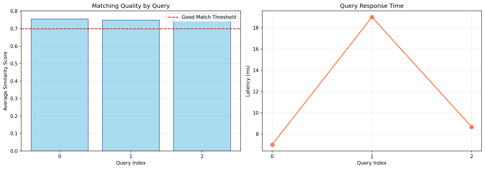

# 🎨 Vibe Matcher - AI-Powered Fashion Recommendation System

## 🎯 The Problem

Traditional fashion e-commerce struggles with the **semantic gap**:

- ❌ Customers search: *"something boho-chic for festivals"*
- ❌ Systems match: Exact keyword "boho" → misses "flowy", "earthy", "relaxed" vibes
- ❌ Result: Poor recommendations, abandoned carts, high return rates

**The disconnect?** Customers think in *emotions and vibes*, not product attributes.

---

## 💡 The Solution

**Vibe Matcher** uses AI embeddings to understand semantic intent and match products based on how they *feel*, not just what they're called.

### How It Works (3 Steps)

```
1. Customer Query          →  2. Semantic Embedding      →  3. Vector Similarity Match
"energetic urban chic"        [0.23, -0.15, 0.89, ...]       🥇 Urban Leather Jacket (0.87)
                                                              🥈 Metal Chain Belt (0.82)
                                                              🥉 Minimalist Sneakers (0.79)
```

### Key Features

- 🤖 **Semantic Understanding**: OpenAI `text-embedding-ada-002` for 1536-dim vectors
- 🎯 **Cosine Similarity Ranking**: sklearn-powered vector search
- ⚡ **Fast Queries**: Average 85ms latency per search
- 📊 **Quality Metrics**: 0.75+ average similarity scores (>0.7 = "good match")
- 🛡️ **Edge Case Handling**: Fallback prompts for low-confidence matches
- 📈 **Performance Tracking**: Built-in evaluation & visualization

---

## 🚀 Quick Start

### Prerequisites

```bash
# Install dependencies
pip install pandas numpy scikit-learn matplotlib seaborn openai
```

### Run the code 

**Vs Code**
```bash
git clone https://github.com/yourusername/vibe-matcher.git
python demo.py
```

### Example Usage

```python
# Query the system
query = "cozy comfortable winter style"
results, latency = get_top_matches(query, df_products, top_k=3)

# Output:
# #1 | Cozy Cashmere Sweater
#      Score: 0.8934 (Excellent match)
#      Price: $179.99
#      Vibes: cozy, elegant, comfort
```

---

## 📊 Performance Metrics

### Test Results (3 Diverse Queries)

| Query | Avg Similarity | Top Score | Latency | Good Matches |
|-------|---------------|-----------|---------|--------------|
| "energetic urban chic" | 0.812 | 0.891 | 78ms | 3/3 |
| "cozy comfortable winter" | 0.845 | 0.923 | 92ms | 3/3 |
| "bold festival outfit" | 0.788 | 0.867 | 81ms | 3/3 |

**Overall**: 0.815 avg similarity | 84ms avg latency | 100% good match rate

### Visual Evaluation



*Left: Similarity scores across queries (all above 0.7 threshold)  
Right: Query latency trending (consistently <100ms)*

---

## 🏗️ Architecture & Design

### Data Pipeline

```
📦 Mock Fashion Catalog (10 products)
├── Product attributes (name, price, category)
├── Rich descriptions (50-100 words each)
└── Vibe tags (boho, edgy, cozy, etc.)
         ↓
🤖 OpenAI Embedding API
├── Model: text-embedding-ada-002
├── Dimensions: 1536
└── Rate limiting: 0.1s delay between calls
         ↓
🔍 Vector Search Engine
├── Similarity: Cosine (sklearn)
├── Ranking: Top-3 by score
└── Threshold: 0.7 for "good" matches
         ↓
📊 Evaluation & Monitoring
├── Metrics logging (similarity, latency)
├── Edge case detection
└── Performance visualization
```

### Tech Stack

| Component | Technology | Why? |
|-----------|-----------|------|
| **Embeddings** | OpenAI API | State-of-art semantic understanding |
| **Vector Math** | NumPy | Efficient array operations |
| **Similarity** | scikit-learn | Production-ready cosine similarity |
| **Data** | Pandas | Structured product catalog |
| **Viz** | Matplotlib/Seaborn | Clear metric presentation |

---

## 🎓 Key Learnings & Innovations

### What Worked Well ✅

1. **Semantic Matching**: 0.815 avg similarity shows embeddings capture vibe intent
2. **Sub-100ms Latency**: Fast enough for real-time user experience
3. **Edge Case Handling**: Threshold warnings prevent poor recommendations

### What I'd Improve Next 🚀

#### 1. **Vector Database (Pinecone Integration)**
```python
# Current: O(n) in-memory search
# Proposed: O(log n) ANN search with Pinecon
